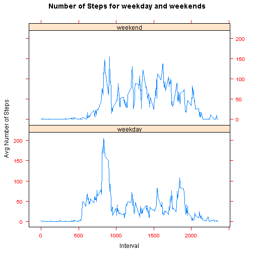

## Intro

This is an R Markdown document that answers the questions of "Reproducible Research" course from [Cousera](https://www.coursera.org). This document was generated with the [Knitr package](http://cran.r-project.org/web/packages/knitr/index.html). 

## Data

The data for this assignment can be downloaded from the course web site:

Dataset: [Activity monitoring data](https://d396qusza40orc.cloudfront.net/repdata%2Fdata%2Factivity.zip) [52K]
The variables included in this dataset are:

**steps**: Number of steps taking in a 5-minute interval (missing values are coded as NA)

**date**: The date on which the measurement was taken in YYYY-MM-DD format

**interval**: Identifier for the 5-minute interval in which measurement was taken

The dataset is stored in a comma-separated-value (CSV) file and there are a total of 17,568 observations in this dataset.


## Loading and preprocessing the data

load necessary libraries


```r
library(dplyr)
```

```
## 
## Attaching package: 'dplyr'
## 
## The following object is masked from 'package:stats':
## 
##     filter
## 
## The following objects are masked from 'package:base':
## 
##     intersect, setdiff, setequal, union
```

```r
library(lubridate)
library(ggplot2)
```

Read data in and convert the date column into date format.


```r
activity<- read.csv('activity.csv', na.strings="NA")
activity$date <- ymd(activity$date)
```


## What is mean total number of steps taken per day?

Calculate the total number of steps taken per day


```r
per_day<- activity %>%
  group_by(date) %>%
  summarise(total_num_steps = sum(steps))
```

Make histogram on the total number of steps taken each day


```r
hist(per_day$total_num_steps, main="Histogram of total number of steps taken per day", col='red')
```

 

Calculate and report the mean and median of the total number of steps taken per day


```r
mean(per_day$total_num_steps, na.rm=TRUE)
```

```
## [1] 10766
```

```r
median(per_day$total_num_steps, na.rm=TRUE)
```

```
## [1] 10765
```


## What is the average daily activity pattern?
Make a time series plot (i.e. type = "l") of the 5-minute interval (x-axis) and the average number of steps taken, averaged across all days (y-axis)


```r
avg_per_interval<- activity %>%
  group_by(interval) %>%
  summarise(avg_num_steps = mean(steps,  na.rm=TRUE))

plot(x=avg_per_interval$interval, y=avg_per_interval$avg_num_steps, 
     type="l", col='red',
     xlab="Interval", ylab="Avg number of Steps", 
     main="Avg Number of Steps For Each Interval")
```

 

Which 5-minute interval, on average across all the days in the dataset, contains the maximum number of steps?


```r
avg_per_interval[avg_per_interval$avg_num_steps == max(avg_per_interval$avg_num_steps), ]
```

```
## Source: local data frame [1 x 2]
## 
##   interval avg_num_steps
## 1      835         206.2
```

## Imputing missing values

Calculate and report the total number of missing values in the dataset (i.e. the total number of rows with NAs)

```r
nrow(activity[is.na(activity$steps), ])
```

```
## [1] 2304
```

Create a new dataset that is equal to the original dataset but with the missing data filled in 
by taking the median of the 5-min interval.


```r
#get the median_num_steps
median_steps_per_interval<- activity %>%
  group_by(interval) %>%
  summarise(median_num_steps = median(steps,  na.rm=TRUE))

#join the data sets together
new_act <- merge(activity, median_steps_per_interval, by="interval", all.x=TRUE)

#set all NA to the median steps for that interval
new_act[is.na(new_act$steps), ]$steps = new_act[is.na(new_act$steps), ]$median_num_steps

#remove the median_num_steps column
new_act<- new_act[, 1:3]
```

Make a histogram of the total number of steps taken each day and Calculate and report the mean and median total number of steps taken per day. Do these values differ from the estimates from the first part of the assignment? What is the impact of imputing missing data on the estimates of the total daily number of steps?

The mean and median values are different from the original data set.

The impact is that the distribution is more skewed to smaller number of steps per day.


```r
new_act_per_day<- new_act %>%
  group_by(date) %>%
  summarise(total_num_steps = sum(steps))

hist(new_act_per_day$total_num_steps, main="Imputing data, total number of steps taken per day", col='red')
```

 

```r
mean(new_act_per_day$total_num_steps) 
```

```
## [1] 9504
```

```r
median(new_act_per_day$total_num_steps)
```

```
## [1] 10395
```


## Are there differences in activity patterns between weekdays and weekends?
Create a new factor variable in the dataset with two levels -- "weekday" and "weekend" indicating whether a given date is a weekday or weekend day.

Make a panel plot containing a time series plot (i.e. type = "l") of the 5-minute interval (x-axis) and the average number of steps taken, averaged across all weekday days or weekend days (y-axis). 


```r
new_act_weekend <- new_act
new_act_weekend$day <- weekdays(new_act_weekend$date)

new_act_weekend[new_act_weekend$day == "Sunday" |  new_act_weekend$day == "Saturday", ]$day <- 'weekend'
new_act_weekend[new_act_weekend$day != "weekend", ]$day <- 'weekday'

new_act_by_day_interval<- new_act_weekend %>%
  group_by(day, interval) %>%
  summarise(avg_num_steps = mean(steps))

new_act_by_day_interval$day = as.factor(new_act_by_day_interval$day)

g<- qplot(interval, avg_num_steps, data=new_act_by_day_interval, col=day, geom="line", facets = day ~ . )  + labs(x = "Interval") + labs(y = "Avg Number of Steps") + labs(title = "Number of Steps for weekday and weekends")
g+ theme(legend.title = element_text(size = 11))
```

 

From the plot, it is obvious that there is difference between weekday and weekend activity patterns.


